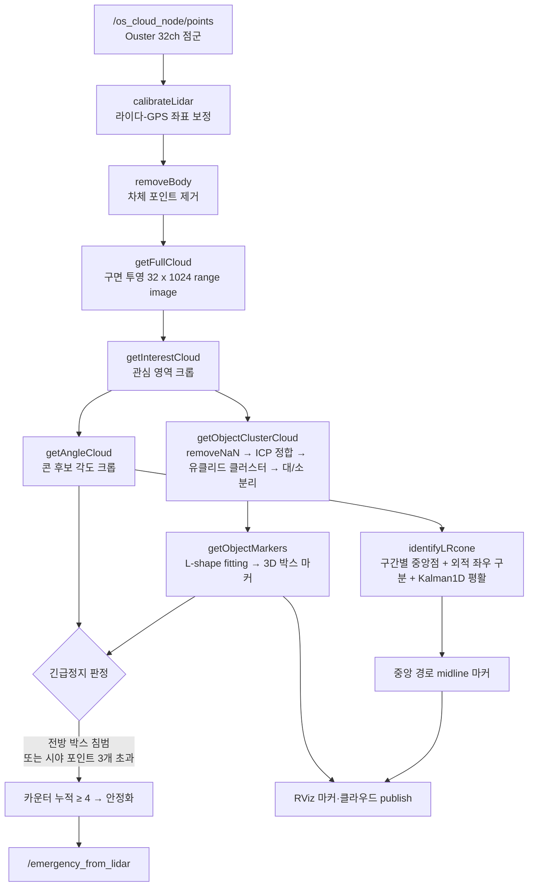

# Lider_Cone_Path 
## LiDAR 점군 인지부터 콘 좌우 구분·중앙 경로 생성까지 C++로 직접 구현한 자율주행 콘 주행 인지 스택


---

## 🎯 소개

**Ouster 32채널 LiDAR 점군을 입력받아 지면 제거 → 클러스터링 → 콘 인식 → 좌우 구분 → 중앙 경로 생성까지 한 프레임 단위로 처리하는 자율주행 콘 주행 인지 파이프라인입니다.** 2025 자율주행모빌리티대회 예선 통과를 목표로 작성한 ROS 노드로, 코드 내 경로에는 `Gigacha_Lidar` 패키지의 일부로 구성되어 있습니다.

핵심은 라이브러리 호출의 조합이 아닙니다. PCL은 복셀·KD트리·유클리드 클러스터 같은 저수준 자료구조로, Eigen과 OpenCV는 행렬 연산 도구로만 사용하고, 그 위에 올라가는 인지·추적·경로 로직(점군의 구면 투영, 각도 기반 지면 분리, 콘 좌우 판별, 중앙선 회귀, 데이터 연관과 추적, 포텐셜 필드 경로)은 C++로 직접 작성했습니다.

- 🧭 **구면 투영 range image**: 원시 점군을 32 x 1024 격자로 매핑해 행/열 인덱스를 부여
- 🧱 **각도 기반 지면 분리**: 인접 링의 상승각을 비교하는 방식으로 지면과 비지면을 분리
- 🔺 **콘 좌우 구분**: x축 구간별 중앙점을 잇고 외적 부호로 좌/우 콘을 나눈 뒤 1D 칼만 필터로 평활
- 🔗 **데이터 연관·추적**: Hungarian 할당 solver 위에 비용행렬 설계·프레임 간 매칭·2D 칼만 갱신·트랙 생명주기 관리를 직접 구현
- 🚗 **L-shape fitting**: 차량 형태 클러스터의 방향각을 분산 기준 탐색으로 추정
- 🛑 **긴급정지 디바운스**: 전방 박스 침범·시야 포인트 수를 카운터로 안정화해 오탐을 억제

---

## 🧩 문제

콘 주행은 좌우로 늘어선 콘 사이를 따라가는 과제입니다. LiDAR 한 대만으로 이를 풀려면 다음을 프레임마다 안정적으로 해내야 합니다.

- **점군은 순서가 없고 노이즈가 많다.** 빛 반사, 하늘, 차체에 찍힌 포인트, 지면이 콘 인식을 방해합니다.
- **콘과 다른 장애물(차량 등)을 구분해야 한다.** 같은 클러스터링을 써도 크기·형태로 콘인지 아닌지 판정하는 규칙이 필요합니다.
- **좌측 콘과 우측 콘을 나눠야 경로가 나온다.** 직선·좌회전·우회전에서 콘 배치가 달라지므로 구간별로 좌우를 판별해야 합니다.
- **프레임마다 흔들리면 주행이 불안정하다.** 순간적으로 누락되거나 튀는 콘을 그대로 쓰면 조향이 진동합니다.
- **전방 충돌 위험은 즉시 감지하되 오탐은 줄여야 한다.** 한 프레임의 오검출로 급정지하면 안 됩니다.

이 저장소는 이 문제들을 외부 인지 라이브러리에 맡기지 않고, 각 단계를 직접 구현한 결과물입니다.

---

## 🧠 방법

전체 알고리즘은 여섯 단계로 나뉩니다. 각 단계는 PCL·Eigen·OpenCV의 기본 연산 위에 직접 작성한 로직입니다.

### 1. 점군 전처리·구면 투영 (`preprocessor.cpp`, `pointcloud_generator.cpp`)
- **캘리브레이션·본체 제거**: Eigen `Affine3f`로 라이다-GPS 좌표를 보정하고, PassThrough로 차체(-0.4~1.5m x, -0.6~0.6m y)에 찍힌 포인트를 제거합니다.
- **구면 투영 (`getFullCloud`)**: 각 포인트의 수직각으로 링(row) 인덱스를, 수평각으로 컬럼(column) 인덱스를 계산해 `N_SCAN(32) x Horizon_SCAN(1024)` 격자에 배치합니다. LeGO-LOAM류의 range image 구성을 직접 옮겨 담았습니다.
- **지면 분리 (`getGrdRemovalClouds`)**: 같은 컬럼에서 아래·위 링 포인트의 높이차로 상승각을 구하고, 임계각 이하이면 지면으로 라벨링합니다. `cv::Mat` 한 장을 지면 라벨 버퍼로 씁니다.
- **관심 영역·각도 크롭 (`cutPointCloud`)**: x·y·z 범위와 xy 평면 각도 범위로 콘 후보 영역만 남깁니다.

### 2. 클러스터링·객체 인식 (`clustering.cpp`)
- **프레임 정합 (`performRegistration`)**: 직전 프레임과 현재 프레임을 PCL ICP로 정합해 움직임을 보정합니다. 수렴 실패 시 현재 클라우드를 그대로 사용하는 폴백을 둡니다.
- **객체 분리 (`clusterObject`)**: 유클리드 클러스터를 뽑은 뒤 y 방향 크기가 0.3m를 넘으면 큰 객체(차량 등)로, 나머지는 중심점만 남겨 작은 객체로 분류합니다.
- **콘 클러스터 (`clusterCone`)**: 최소 5포인트 이상 클러스터를 잡되 x·y 크기가 0.6m를 동시에 넘으면 콘이 아니라고 보고 제외합니다.

### 3. 콘 좌우 구분 (활성 경로: `identifyLRcone`)
메인 노드가 실제로 호출하는 좌우 구분 방식입니다.
- x축을 겹치는 세 구간 `{1.3~5.3}, {3.3~7.3}, {5.3~9.3}`으로 나누고, 각 구간의 콘 y 평균으로 중앙점을 구합니다.
- 이전 중앙점과의 차이를 보정하고, **구간별 1D 칼만 필터(`Kalman1D`)**로 중앙점을 평활해 프레임 간 진동을 줄입니다.
- 인접한 두 중앙점을 잇는 선에 대해 **외적 부호(`crossLine`)**로 각 콘이 좌측인지 우측인지 판별합니다.
- 좌/우 콘 중심과 중앙점을 이어 RViz용 중앙 경로 마커(midline)를 생성합니다. 이 중앙선이 콘 주행의 목표 경로가 됩니다.

### 4. 데이터 연관·추적 (대안 경로: Hungarian + Kalman)
좌우 구분과 프레임 간 콘 추적을 위한 또 다른 구현이 함께 들어 있습니다.
- **Hungarian 기반 좌우 할당 (`identifyLRcone_v2`)**: 좌/우 기준점과 모든 콘 사이의 제곱 거리로 2 x N 비용행렬을 만들고, 회전 방향(좌/우/직진)에 따라 기준점을 backstep 시키며 콘을 1대1로 할당합니다.
- **콘 추적 (`saveCluster`)**: 이전 프레임 콘과 현재 콘을 Hungarian으로 매칭하고, 매칭된 콘은 2D 칼만 필터로 좌표를 갱신합니다. 매칭되지 않은 콘은 예비 버퍼(`clusterStopOver`)에 넣고 intensity를 트랙 신뢰도 카운터로 써서 생성·유지·소멸을 관리합니다. 즉 비용행렬 설계, 데이터 연관, 상태 추정, 트랙 생명주기까지 다중 객체 추적의 골격을 직접 짰습니다.
- **할당 solver 자체는 직접 구현이 아닙니다.** `Hungarian.cpp`는 Cong Ma(Markus Buehren의 MATLAB 이식본)의 BSD 라이선스 Munkres 구현을 사용합니다. 직접 작성한 부분은 그 solver를 호출하기 위한 비용행렬 구성과, 그 결과를 추적·좌우 구분에 엮는 로직입니다.
- 참고로 `saveCluster`는 코드에 "현재 사용되지 않는 함수"로 표시되어 있고, 메인 노드의 활성 경로는 3번의 `identifyLRcone`입니다. 저장소는 여러 접근을 반복 실험한 흔적을 그대로 담고 있습니다.

### 5. 경로 계획
- **중앙선 회귀 (`setConeROI`)**: 중앙점을 15회 반복 추정하며 각 스텝에서 Eigen `jacobiSvd`로 1차 선형회귀를 풀어 진행 방향을 잡고, 마지막에 3차 다항식으로 전체 중앙선을 피팅합니다. 기울기 변화량에 상한을 둬 급격한 꺾임을 막습니다.
- **APF 포텐셜 필드 (`pathPlaner.cpp`)**: 장애물로부터의 반발력과 진행선으로의 인력을 여러 거리·각도 후보에서 계산하고, 거리별 가중치로 최종 조향각을 정하는 인공 포텐셜 필드 플래너를 별도 모듈로 구현했습니다.

### 6. 차량 헤딩 추정 — L-shape fitting (`utility.cpp`)
- 큰 객체(차량) 클러스터의 방향각을 0~89도까지 1도씩 회전시키며, 두 직교 축으로 점을 투영해 **분산 기준(`variance_criterion`)** 비용을 계산하고 비용이 최대인 각도를 방향으로 택합니다. 탐색 기반 사각형 피팅으로 바운딩 박스의 회전을 추정합니다.
- 추정한 방향으로 12개 모서리를 가진 3D 바운딩 박스 마커(`bbox_3d`)를 생성합니다.

### 부가: 멀티프로세스 카메라-라이다 융합 (`utility.cpp`)
- `fork` / `execl` / `pipe`로 카메라 융합 실행 파일을 자식 프로세스로 띄우고, 캘리브레이션 파라미터와 토픽 이름을 파이프로 직렬화해 전달하는 POSIX IPC를 직접 작성했습니다. 인지 파이프라인 바깥의 저수준 시스템 코드입니다.

---

## 🛠 기술 스택

| 구분 | 기술 |
|---|---|
| **언어** | C++ (C++14/17: `make_unique`, structured bindings, lambda, smart pointer) |
| **미들웨어** | ROS1 (roscpp, sensor_msgs, geometry_msgs, visualization_msgs, tf, message_filters, vision_msgs, pcl_ros) |
| **점군 처리** | PCL — VoxelGrid, PassThrough, EuclideanClusterExtraction, KdTreeFLANN, IterativeClosestPoint(ICP), NormalEstimation, RegionGrowing, getMinMax3D |
| **선형대수** | Eigen — `jacobiSvd` 회귀, `Affine3f` 좌표 변환, 2D 칼만 행렬 연산 |
| **수치·행렬** | OpenCV `cv::Mat` — L-shape 분산 기준, 지면 라벨 매트릭스 |
| **할당 알고리즘** | Hungarian/Munkres solver (Cong Ma, BSD) — 그 위 비용행렬·데이터 연관·추적 로직은 직접 구현 |
| **맵 입출력** | jsoncpp — 전역 경로 JSON 로드 |
| **시스템** | POSIX `fork`/`execl`/`pipe` — 카메라-라이다 융합 멀티프로세스 IPC |
| **센서** | Ouster 32채널 LiDAR (`N_SCAN` 32, `Horizon_SCAN` 1024, `/os_cloud_node/points`) |

> 직접 구현한 알고리즘 요소: 구면 투영 range image, 각도 기반 지면 분리, 크기 게이팅 콘 클러스터, 구간별 중앙점 + 외적 기반 콘 좌우 구분, 1D·2D 칼만 필터, Hungarian 위 데이터 연관·트랙 생명주기, 선형/3차 다항 중앙선 회귀, APF 포텐셜 필드, L-shape fitting, 멀티프로세스 IPC. PCL·Eigen·OpenCV는 자료구조와 연산 도구로만 사용했습니다.

---

## 📁 프로젝트 구조

```
Lider_Cone_Path/
├── src/
│   ├── main/
│   │   ├── practics_dynamic_EV.cpp        # ROS 노드 진입점: 프레임별 인지 파이프라인 + 긴급정지 디바운스
│   │   ├── practics_dynamic_EV (copy).cpp # 좌/우 콘 토픽을 별도 구독하는 변형본
│   │   └── GPS_maker.cpp                  # PoseStamped 더미 퍼블리셔 (로컬 좌표 대체용)
│   ├── pointcloud_generator.cpp           # 구면 투영 range image, 지면 분리, ROI, 클러스터 생성 진입
│   ├── preprocessor.cpp                   # 캘리브레이션, 본체 제거, voxel, 3D→2D, 각도 크롭, 좌우 판별 기하
│   ├── clustering.cpp                     # 콘/객체 클러스터링, ICP 정합, 콘 좌우 구분, 중앙선 회귀, Hungarian+Kalman 추적
│   ├── pathPlaner.cpp                     # APF(인공 포텐셜 필드) 조향각 계산
│   ├── utility.cpp                        # 상수, 좌표 변환, 칼만 필터, L-shape fitting, 멀티프로세스 카메라 융합, 맵 리더
│   └── Hungarian.cpp                      # Munkres 할당 solver (Cong Ma, BSD)
└── README.md
```

> 이 저장소는 소스(`src/*.cpp`)만 담은 알고리즘 발췌본입니다. 헤더(`*.h`)와 `CMakeLists.txt`·`package.xml` 같은 빌드 파일은 상위 catkin 패키지(`Gigacha_Lidar`)에 있으며 여기에는 포함되어 있지 않습니다.

---

## 🏗 파이프라인

메인 노드(`practics_dynamic_EV.cpp`)가 한 프레임을 처리하는 흐름입니다.



**대안·실험 경로 (코드에 함께 존재)**

- `identifyLRcone_v2` — Hungarian 할당으로 콘 좌우 구분 (회전 방향별 backstep 기준점)
- `saveCluster` — Hungarian 매칭 + 2D 칼만 + 예비 버퍼로 콘을 프레임 간 추적 (현재 사용되지 않음으로 표시)
- `setConeROI` — 반복 선형회귀 + 3차 다항 중앙선 피팅으로 ROI 설정
- `pathPlaner` (APF) — 반발력·인력 기반 조향각 계산 모듈

---

## 🐛 빌드·실행

이 저장소는 상위 ROS1 catkin 패키지(`Gigacha_Lidar`)에서 떼어낸 소스 발췌본이라 단독으로는 빌드되지 않습니다. 실행하려면 아래 전제가 필요합니다.

**전제 조건**
- ROS1 (Melodic/Noetic 권장), catkin 워크스페이스
- PCL, Eigen, OpenCV, jsoncpp
- 헤더 파일(`clustering.h`, `pointcloud_generator.h`, `preprocessor.h`, `pathPlaner.h`, `utility.h`, `Hungarian.h`)과 `CMakeLists.txt`·`package.xml` (상위 패키지 소속, 이 저장소에는 미포함)
- Ouster 32채널 LiDAR가 `/os_cloud_node/points`로 점군을 퍼블리시하는 환경 또는 rosbag
- 코드에 하드코딩된 경로 두 곳을 사용 환경에 맞게 수정해야 합니다.
  - 전역 경로 맵: `mapReader("/home/kim/catkin_ws_practice/src/Gigacha_Lidar/json_map/real_real_final_map.json")`
  - 카메라 융합 실행 파일: `/home/sadgod33/catkin_ws/devel/lib/pcl_cpp_tutorial/fusion_object`, `.../fusion_line`

**실행 개요 (전체 패키지가 갖춰졌다고 가정)**

```bash
# 1) 소스와 헤더를 catkin 패키지에 배치하고 빌드
cd ~/catkin_ws
catkin_make          # 또는 catkin build

# 2) 워크스페이스 환경 적용
source devel/setup.bash

# 3) LiDAR 드라이버 또는 rosbag 로 /os_cloud_node/points 공급 후 노드 실행
rosrun <package> practics_dynamic_EV
```

- 실행 시 노드는 프레임마다 처리 시간과 큰 객체 수, 긴급정지 상태를 콘솔에 출력합니다.
- 결과 점군과 콘 좌우, 중앙 경로 마커는 RViz에서 확인합니다. 주요 토픽: `/coneClusterCloud`, `/mid_line_marker_array`, `/markers_vis`, `/emergency_from_lidar`.
